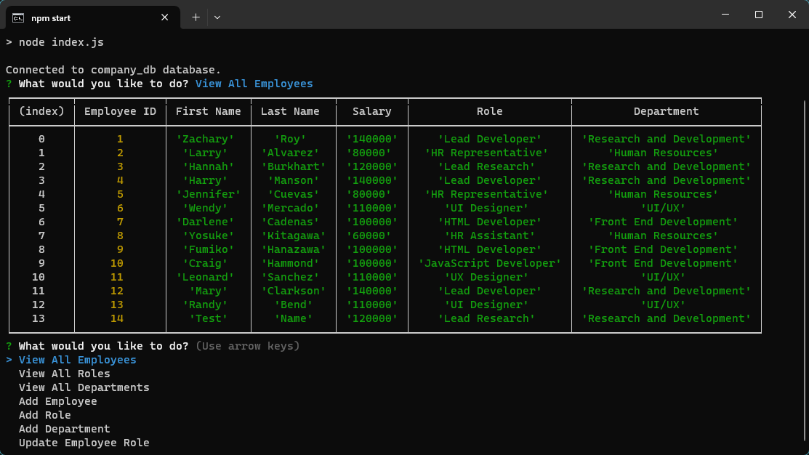

# Fullstack Development Challenge 10

## Welcome to the tenth Challenge of the UCLA Bootcamp!

In this challenge we were supposed to start from a scratch and an employee tracker using inquirer and MySQL! To do this, we are using node.js to start an index.js file and pull up a database of employees in our system! To start, lets look at our requirements:

## User Story

```md
AS A business owner
I WANT to be able to view and manage the departments, roles, and employees in my company
SO THAT I can organize and plan my business
```

## Acceptance Criteria

```md
GIVEN a command-line application that accepts user input
WHEN I start the application
THEN I am presented with the following options: view all departments, view all roles, view all employees, add a department, add a role, add an employee, and update an employee role
WHEN I choose to view all departments
THEN I am presented with a formatted table showing department names and department ids
WHEN I choose to view all roles
THEN I am presented with the job title, role id, the department that role belongs to, and the salary for that role
WHEN I choose to view all employees
THEN I am presented with a formatted table showing employee data, including employee ids, first names, last names, job titles, departments, salaries, and managers that the employees report to
WHEN I choose to add a department
THEN I am prompted to enter the name of the department and that department is added to the database
WHEN I choose to add a role
THEN I am prompted to enter the name, salary, and department for the role and that role is added to the database
WHEN I choose to add an employee
THEN I am prompted to enter the employee’s first name, last name, role, and manager, and that employee is added to the database
WHEN I choose to update an employee role
THEN I am prompted to select an employee to update and their new role and this information is updated in the database 
```

## Installation Instructions

To install, simply download the files first. After that, you should copy and paste the schema and seeds.sql files into your MySQL workbench, and then from there you will have your database initialized. After that, just simply install the node modules by typing in npm i, and then start the application with npm start.

## The Completed Challenge


After completing the challenge, we should now have a working index.js file that will allow you to manage an employee database using node and MySql. From there, you can select which option you would like to choose, and even create employees, roles, and departments through some choices.

To view a demo of this application, please click [here.](https://drive.google.com/file/d/1-rJlOVyOI98UNUf0NzZ5wZd7YaNLiaPH/view?usp=sharing).

## Credits
This code was completed by Zachary Roy